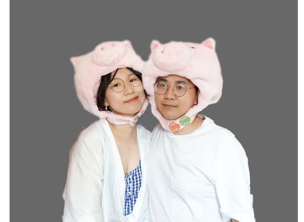
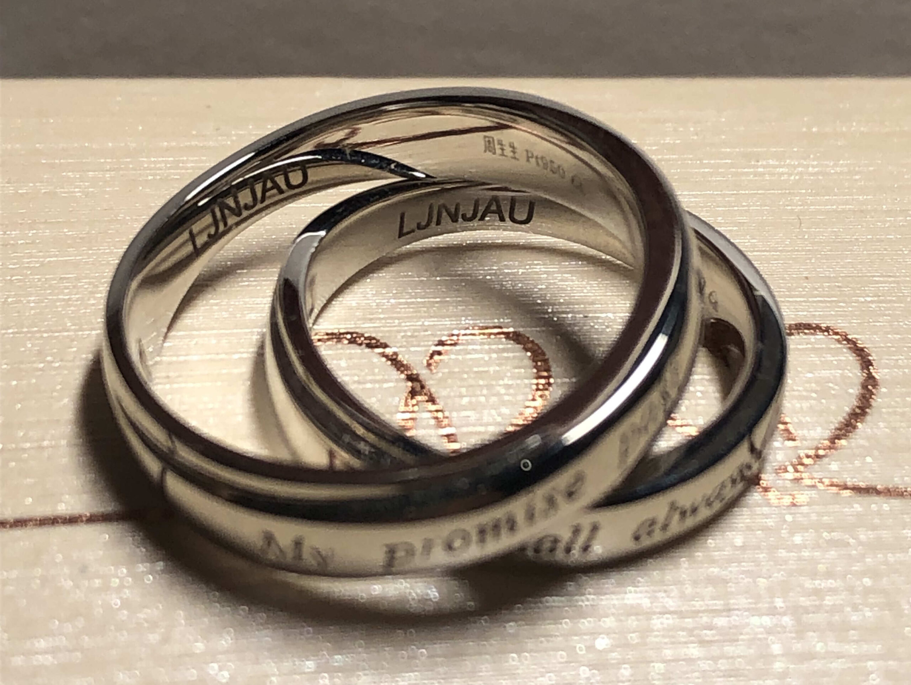
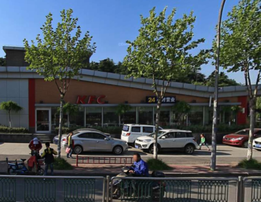
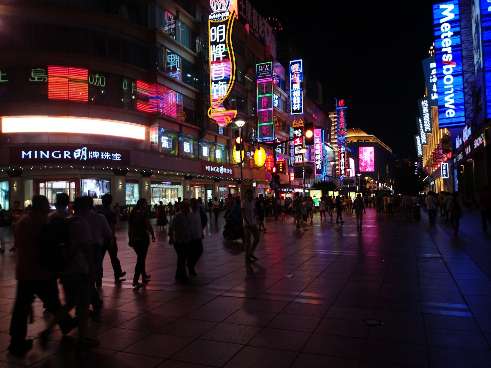
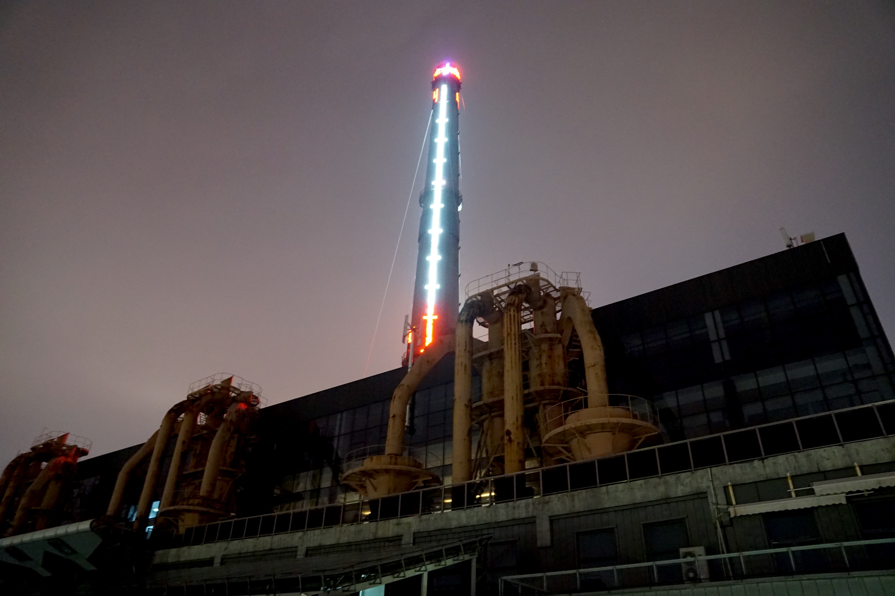
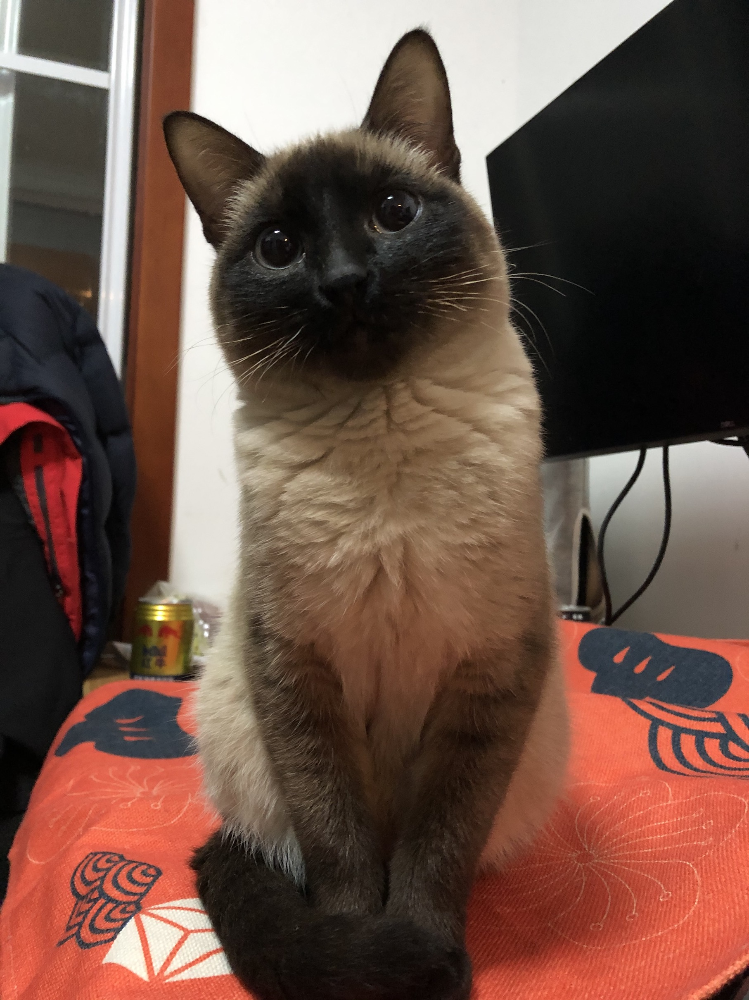
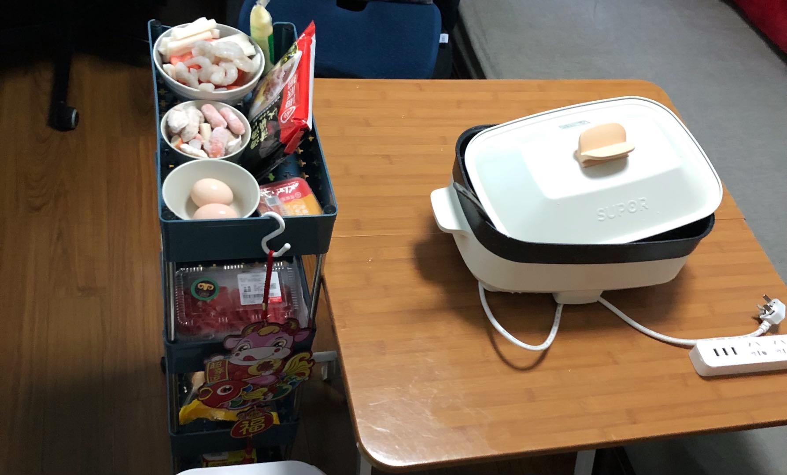
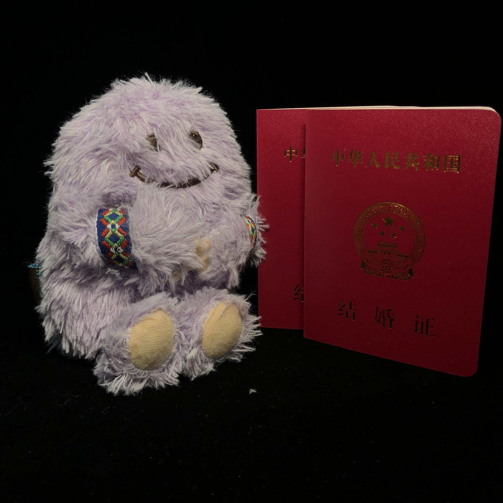

# 卢书洋 & 贾凯雯

> 2021.10.16 stand by us

<audio controls src="./StandByMe.mp3">
</audio>

# 关于我们(about us)

## 贾凯雯 🎹

- 欢乐的🐷一个

- 没用的事情记忆专家，什么都了解一点工程师；

- 喜欢不懂的东西，生鱼片爱好者（以前不喜欢，现在不敢吃）；

- 追求艺术但是品味比较过时。

---

## 卢书洋 🎸

欢乐的🐷另一个

电脑倒腾专家，推倒重来高级工程师；

喜欢新鲜事物，数码产品爱好者（以前是狂热爱好者）；

追求艺术但是往往没有审美。

# 他们的故事(Book Of Love)

> （由哈金博士讲述）

---

## 肯德基的故事

> 2011 09 16

大学军训期间，卢书洋和他的舍友们吃到了入学后的第一顿肯德基，听说是同班的一个女生请客的。那时班上的男、女生还没怎么见过面。

那么，这个女生是谁呢？

正当大家吃着起劲，突然班长冲进来说这是班里的贾凯雯同学过生日请大家吃的。

于是卢书洋和他的舍友们纷纷掏出手机，纠结要不要祝这位同学生日快乐。

这顿肯德基吃得叫人心神不定。不过卢书洋也算是认识了贾凯雯了。

---

## NJAU

> 2011 - 2015

如果一定要用几个字来概括他们大学时代的故事，那我想一定是NJAU了。这四个字母包含的太多，他们大学时代所有的故事，都在此发生。

而这四个字母最终和他们的名字一起，被刻在了戒指上。

---

## 肯德基的故事后续

> 2015 06 21

整个大学期间卢书洋和贾凯雯只是同学、同事，但是男生的内心其实期望更进一步，终于在毕业典礼前一天，鼓足了勇气把女生约到了肯德基（为什么又是肯德基！），在这里开展了强烈的爱情攻势。

也许是女生终于被男生的赤诚之心感动，终于答应了下来，男生终于在毕业之前收获了爱情。

但是等待他们的，是严酷的爱情试炼。

哦对了，这里面还有一个关键人物，是他们成为恋人关系的第一个见证人。

---

## 第一次旅行

> 2015 06

6月底的上海的夜晚似乎还没有夏天的燥热，晚风吹过两人的面庞，两人在毕业前就计划一起去上海玩一趟，未曾想最后是作为情侣一起去旅行了。

杜莎夫人蜡像馆，这是他们去的第一个地方。

第一次旅行，两人买了一个雪山怪公仔做纪念。

在上海火车站分别时，看着奔腾的车流，络绎的行人，高耸的大厦，置身在这样的繁华都市，两个人不禁担忧起未来的工作与生活，即将到来的漫长异地恋使一场和时间的赛跑无法避免。

---

## 麦当劳奇遇

> 2017 01 01

<video controls width="auto" height="550px">
    <source src="./麦当劳.mp4#t=0.01"/>
</video>

2017元旦，他们选择在北京跨年。本来想在国贸倒数的，但是为了预防公众事件，国贸的商场临时接到通知全部关闭。

他们只好来到了后海，在后海周围一直转悠，终于等到零点，钻进了一家小酒吧，里面的驻唱乐队正好开始倒数，在极少数人的欢呼下，他们跨过了催人成长的2016年。

错过了地铁也打不到车，他们只能在寒风中骑车来到健德门麦当劳，在里面一直待到了5点，赶了第一班地铁离开。

---

## 世纪钟

> 2018 01 01

2017是奔波的一年，他们的先后在北京、南京、苏州、深圳、济南、成都、重庆、杭州相见，成为了中国高铁和民航的头号粉丝，最终他们选择在天津，世纪钟前跨年。

今年的跨年比较顺利，一起来看看他们说了什么：

<video controls height="550px">
    <source src="./天津.mp4#t=0.1"/>
</video>

---

## 地球最后的夜晚

> 2019 01 01

不平凡的2018年！他们在北京和上海活动，踪迹遍布于北京的火车博物馆，国家大剧院，朝阳大悦城，侨福芳草地；上海的玻璃博物馆，360蹦床（年轻的卢书洋为此付出了惨痛的代价），双年展等地。

2018也是富有艺术气息的一年！

不过他们在跨年上遭遇了滑铁卢。由于相信了某电影的宣传，他们选择观看此电影进行跨年，如果你刚好知道是哪一部电影，可能也深有体会吧。

---

## 杏鲍菇 - 猫

> 2020 01 01

2019是稀松平常的一年，他们仿佛已经习惯了在京沪高铁上，穿梭于城市之间。

在2020到来之际，他们去了一趟上海科技馆，拜见了生物老祖宗，詹姆斯·沃森与佛朗西斯·克里克（贾凯雯模仿DNA的双螺旋愉快地旋转了一番）。今年他们不再跑出去跨年，而是两个人（还有一只猫！）相互陪伴，默默地跨过了2019。

---

## 团聚

> 2020 08 29

后来的情况大家也知道了，2020一点都不平常，疫情的肆虐，终于让俩人相隔千里，8个月没有见面。彼时贾凯雯还面临文章、论文、答辩的压力，让这注定是辛苦的一年。

终于，贾凯雯完成了她的学业，可以投身于社会主义现代化的建设中。不过在此之前，她需要和卢书洋汇合，这也意味着他们俩终于结束了爱情长征，再也不用为了相见而奔波。

两人的新故事也从那时开始展开，如果你想听，我可以讲一天。不过可以肯定的是，2020跨年，他们再也不会在短暂的相聚后感受到分别的痛苦了，小火锅整起来！

---

## 神奇的一天

> 2021 05 15

真是童心未泯！这两人好像没有长大，居然跑去迪士尼玩！迪士尼的口号是祝你拥有神奇的一天，也不知道有什么神奇的魔法能够抵消排队带来的痛苦。

但是贾凯雯事先不知道的是，夜晚真的发生了神奇的事情。

伴随着烟火铺满天空，城堡上灯光闪烁，仿佛周围拥挤的人群也不再令人在意。突然，她感觉到手被握紧，下一秒，她的手指被带上了戒指。人群中，在烟花和音乐的笼罩下，他轻柔的求婚声只进入了她的耳朵。他们紧紧相拥，仿佛拥有了整个世界。

真是一枚魔法的戒指（上面有米老鼠头）。

---

## 雪山怪的见证

> 2021 06 22

时间来到了最近，这俩位终于迎来了他们的高光时刻，他们决定去领证啦！

从2015年开始一直陪伴今天，没有谁比雪山怪更适合见证这两人成为夫妻了！

他们带着雪山怪，去民政局登记结婚了。

---

## Welcome to our wedding

Welcome !!!!!

# 美好的祝福(best wishes)

## Lu Shuyuan

> 卢书洋弟弟

<video controls width="300px" height="auto" poster="./7651633266750_.pic_-1-e1633267042299.jpg">
    <source src="./lushuyuan.mp4"/>
</video>

## Liang Yaqi​

> 贾凯雯妹妹

<video controls width="300px" height="auto" poster="./EC25FA22-E25B-4DC1-A93B-3C3A3D5B67F8-3200-0000040B85802EFF_tmp-1.jpg">
    <source src="./YaQi.mp4#t=0.01"/>
</video>

# 送出祝福吧！(send your wish)

请在下面评论区留下祝福吧！

# Thanks for watching !

感谢你能看到这里

