# Kerberos 简介

Kerberos 是一个由 MIT 开发的一个认证协议，它不仅可以解决互联网上客户端和服务端的认证问题（单点登录），还可以解决服务端与服务端的相互认证问题（比如 api 服务去链接被 kerberos 保护起来的 kafka 或者 ldap）

Kerberos 认证流程

这里放一张的Kerberos的认证流程，流程详见[维基百科](https://en.wikipedia.org/wiki/Kerberos_(protocol))。

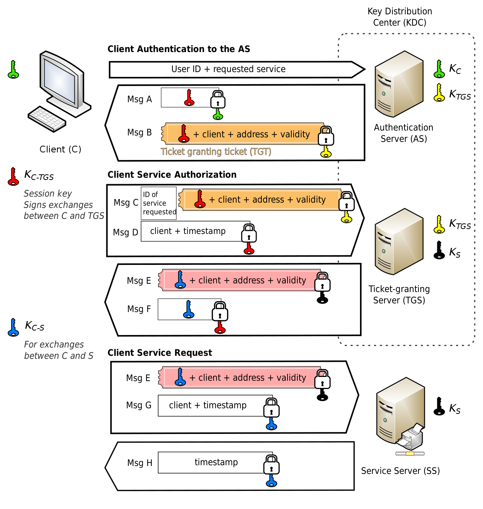

简单来说，当一个客户端（客户端可以是终端用户，也可以是某一个服务，比如我们写的backend去链接kafka时，我们的backend就是客户端）需要去申请访问其他服务是，通过 ticket 加一系列的秘钥交换可以获取与 service server 端交互的 Kc-s，随后 Client-Server 使用 Kc-s 进行相互认证的故事。

# Kerberos 单点登录原理

不像其他SSO服务，比如 Oauth2，使用重定向才能完成认证，kerberos 需要系统级别的支持。（kerberos 本身不是 HTTP 服务，他需要特定的客户端，比如 kinit 工具来进行登录）

简单来说，当浏览器访问某一个开启 kerberos 保护的网站时，网站的服务端会返回 401 响应并返回一个特殊的 WWW-Authenticate 头，来要求浏览器进行认证。

在 Chromium 内核中（同理firefox），它允许有以下几个值

```text
*   Basic: 1
*   Digest: 2
*   NTLM: 3
*   Negotiate: 4
```

这些认证方式能够直接被浏览器处理，不需要任何前端就可以进行认证。

其中：

Basic 和 Digest 比较简单，都是通过携带用户名密码在 Http Header 中来完成认证（ Digest 传递的是用户名密码的哈希）。

NTLM 是微软搞的一种认证方式，这里不做展开。

Negotiate 则是告诉浏览器要使用 kerberos 进行认证。

因此在服务端开启 kerberos 认证后，如果在认证信息缺失的情况下，它返回的消息中包含这样一个头信息。

```text
WWW-Authenticate: Negotiate
```

前面说了，kerberos ticket 是存储在系统内部的，无法被浏览器直接访问到。那么浏览器为了能够获取用户的 kerberos ticket（kerberos 凭证），或者是在发现没有凭证时要求用户进行登录，都必须要调用系统相关接口进行获取。

The Generic Security Services Application Program Interface (GSSAPI) 通用安全服务应用程序接口，它允许浏览器或者其他应用程序进行调用，通过现有的 kerberos ticket 来获取用户正在访问的服务的凭证（大概是直接获取流程图中的最后一个 MsgE 和 MsgG 的内容）。从而完成一次 Negotiate 的认证

>  在 windows 下称为 Simple and Protected GSSAPI Negotiation Mechanism (SPNEGO) ，它要解决的事情和 GSSAPI 相同，可以将他直接看做 GSSAPI 的微软版本。

随后，浏览器会将这个认证信息携带在 Authorization 头中，并标注该凭证为 Negotiate 或者 Kerberos（就和我们如果是 Bearer Token 需要以 Bearer 开头一样），他看起来应该像这样：

```text
Authorization: Negotiate ${KERBEROS_BASE64_CREDENTIAL}
```

服务端接收到请求后，成功校验 Authorization 后便完成了单点登录。

只要用户进行过 kerberos 的登录，这一切都是由浏览器自动完成的，用户不需要进行任何其他操作。

这无疑是一种更加无缝的单点登录方式。

# Kerberos 服务端搭建

## 安装 krb5 服务端

krb5 是 Kerberos 的第五个版本，这里用Ubuntu做演示，安装方法为：

```bash
sudo apt install krb5-kdc krb5-admin-server
```

安装过程中，会询问我们需要创建的 realm 名称，Realm 表示一个 namespace，下面的资源相互隔离。

这里输入 EXAMPLE.COM （注意全大写）。

安装完成后，输入命令来初始化这个 realm

```bash
sudo krb5_newrealm
```

此时，krb5 将会询问用户一个密码，来作为本地数据库的密码（krb5默认使用[DB2](https://zh.wikipedia.org/wiki/IBM_DB2)存储信息，但是一般会使用LDAP作为krb5的存储后端）

在 krb 中，分为 KDC 和 AS 两个角色，详见[维基百科](https://en.wikipedia.org/wiki/Kerberos_(protocol))。

我们需要对 /etc/krb5.conf 进行一些配置，指定 default_realm，并设置 EXAMPLE.COM 的配置

```conf
[libdefaults]
    default_realm = EXAMPLE.COM
    kdc_timesync = 1
    ccache_type = 4
    forwardable = true
    proxiable = true
    debug = true
    dns_lookup_realm = false
    dns_lookup_kdc = false
    fcc-mit-ticketflags = true


[realms]
    # 配置 EXAMPLE.COM 的服务地址
    EXAMPLE.COM = {
        kdc = kdc.example.com
        admin_server = admin.example.com
        default_domain = example.com
    }


[domain_realm]
    # 将 EXAMPLE.COM realm 映射到 example.com 域名
    .example.com = EXAMPLE.COM
    example.com = EXAMPLE.COM
```

为了能进一步进行测试，我们需要在 /etc/hosts 中增加一条解析记录，将必要的域名都解析到本地

```bash
# kerberos
127.0.0.1	    example.com admin.example.com kdc.example.com kerberos.example.com
```

## 初始化 Principals

在 Kerberos 中，所有的客户端都被称为 principal（如果是提供服务的 principal 称为 service principal）

为了进行测试，可以创建两个 principal ，一个表示客户的浏览器，一个表示后端服务。

输入 `sudo kadmin.local` 进入交互界面

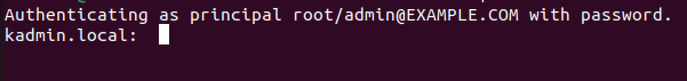

输入 `addprinc user1` 来创建一个 principal，输入 `user1` 的密码，比如 123456

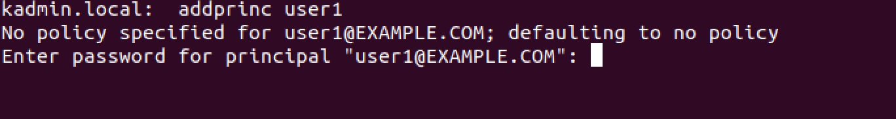

除了自己输入密码，还可以让 kadmin 自动为我们生成一个密码。

现在，创建一个提供 HTTP 服务的 pricipal，使用 `-randkey` 来使用随机密码。

输入 `addprinc -randkey HTTP/api.example.com@EXAMPLE.COM` 来创建一个 principal。

注意，service pricipal 需要遵循一些格式，比如提供 http 服务的就需要使用 HTTP/ 开头，提供 LDAP 服务的就要以 LDAP/ 开头。

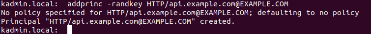

既然密码已经随机了，那我们就不能再使用密码进行登录认证了，而是要通过 krb5 的 keytab 来进行认证。

现在使用命令 `ktadd -k /root/api.keytab HTTP/api.example.com@EXAMPLE.COM` 来生成一个 keytab 文件。

这个 keytab 文件是后面我们HTTP服务要用的，而现在我们模拟用户进行登录，输入`kinit -p user1@EXAMPLE.COM` 进行登录，输入密码后，登录成功

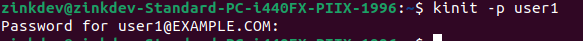

查看自己有没有登录成功，可以使用 `klist` 来进行查看

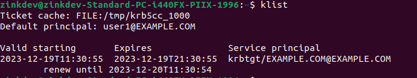

此时系统应该能显示出我们获取的 ticket 以及有效期等信息，使用这个 ticket，我们便可以去和刚才的 HTTP 服务做校验了。

# 编写支持 Kerberos 认证的  HTTP 服务

这里使用 spring-security-kerberos 这个库来处理 HTTP 服务，引入必要的库

```xml
     <dependencies>
        <dependency>
            <groupId>org.springframework.boot</groupId>
            <artifactId>spring-boot-starter-web</artifactId>
        </dependency>


        <dependency>
            <groupId>org.springframework.boot</groupId>
            <artifactId>spring-boot-starter-security</artifactId>
        </dependency>


        <dependency>
            <groupId>org.springframework.security.kerberos</groupId>
            <artifactId>spring-security-kerberos-web</artifactId>
            <version>1.0.1.RELEASE</version>
        </dependency>


        <dependency>
            <groupId>org.springframework.security.kerberos</groupId>
            <artifactId>spring-security-kerberos-client</artifactId>
            <version>1.0.1.RELEASE</version>
        </dependency>
    </dependencies>

```


这里使用2.x版本的 Springboot 和 1.0.1.RELEASE 版本的 kerberos 库。

接着参考以下代码

```java

package com.example.demo;


import java.security.Principal;
import java.util.Collection;
import java.util.Collections;
import java.util.Enumeration;


import javax.servlet.http.HttpServletRequest;


import org.springframework.context.annotation.Bean;
import org.springframework.context.annotation.Configuration;
import org.springframework.core.io.ClassPathResource;
import org.springframework.core.io.FileSystemResource;
import org.springframework.security.authentication.AuthenticationManager;
import org.springframework.security.authentication.ProviderManager;
import org.springframework.security.config.annotation.web.builders.HttpSecurity;
import org.springframework.security.config.annotation.web.configuration.EnableWebSecurity;
import org.springframework.security.core.GrantedAuthority;
import org.springframework.security.core.authority.SimpleGrantedAuthority;
import org.springframework.security.core.context.SecurityContextHolder;
import org.springframework.security.core.userdetails.UserDetails;
import org.springframework.security.core.userdetails.UserDetailsService;
import org.springframework.security.core.userdetails.UsernameNotFoundException;
import org.springframework.security.kerberos.authentication.KerberosAuthenticationProvider;
import org.springframework.security.kerberos.authentication.KerberosServiceAuthenticationProvider;
import org.springframework.security.kerberos.authentication.sun.SunJaasKerberosClient;
import org.springframework.security.kerberos.authentication.sun.SunJaasKerberosTicketValidator;
import org.springframework.security.kerberos.web.authentication.SpnegoAuthenticationProcessingFilter;
import org.springframework.security.kerberos.web.authentication.SpnegoEntryPoint;
import org.springframework.security.web.SecurityFilterChain;
import org.springframework.security.web.authentication.www.BasicAuthenticationFilter;
import org.springframework.web.bind.annotation.GetMapping;
import org.springframework.web.bind.annotation.RestController;


@Configuration
@RestController
@EnableWebSecurity
public class Config {


    @GetMapping(value = "/home")
    public String home(HttpServletRequest req) {
        UserDetails user = (UserDetails) SecurityContextHolder.getContext().getAuthentication().getPrincipal();
        return "welcome home " + user.getUsername();
    }


    // @Value("${app.service-principal}")
    private String servicePrincipal = "HTTP/api.example.com@EXAMPLE.COM";


    // @Value("${app.keytab-location}")
    private String keytabLocation = "api.keytab";


    @Bean
    SecurityFilterChain filterChain(HttpSecurity http) throws Exception {
        KerberosAuthenticationProvider kerberosAuthenticationProvider = kerberosAuthenticationProvider();
        KerberosServiceAuthenticationProvider kerberosServiceAuthenticationProvider = kerberosServiceAuthenticationProvider();
        ProviderManager providerManager = new ProviderManager(kerberosAuthenticationProvider,
                kerberosServiceAuthenticationProvider);


        http
                .authorizeHttpRequests(
                        (authz) -> authz
                                .requestMatchers().permitAll()
                                .anyRequest().authenticated())
                .exceptionHandling(e -> e.authenticationEntryPoint(spnegoEntryPoint()))
                .authenticationProvider(kerberosAuthenticationProvider())
                .authenticationProvider(kerberosServiceAuthenticationProvider())
                .addFilterBefore(spnegoAuthenticationProcessingFilter(providerManager),
                        BasicAuthenticationFilter.class);
        return http.build();
    }


    @Bean
    KerberosAuthenticationProvider kerberosAuthenticationProvider() {
        KerberosAuthenticationProvider provider = new KerberosAuthenticationProvider();
        SunJaasKerberosClient client = new SunJaasKerberosClient();
        client.setDebug(true);
        provider.setKerberosClient(client);
        provider.setUserDetailsService(dummyUserDetailsService());
        return provider;
    }


    @Bean
    SpnegoEntryPoint spnegoEntryPoint() {
        return new SpnegoEntryPoint();
    }


    SpnegoAuthenticationProcessingFilter spnegoAuthenticationProcessingFilter(
            AuthenticationManager authenticationManager) {
        SpnegoAuthenticationProcessingFilter filter = new SpnegoAuthenticationProcessingFilter();
        filter.setAuthenticationManager(authenticationManager);
        return filter;
    }


    @Bean
    KerberosServiceAuthenticationProvider kerberosServiceAuthenticationProvider() {
        KerberosServiceAuthenticationProvider provider = new KerberosServiceAuthenticationProvider();
        provider.setTicketValidator(sunJaasKerberosTicketValidator());
        provider.setUserDetailsService(dummyUserDetailsService());
        return provider;
    }


    @Bean
    SunJaasKerberosTicketValidator sunJaasKerberosTicketValidator() {
        SunJaasKerberosTicketValidator ticketValidator = new SunJaasKerberosTicketValidator();
        ticketValidator.setServicePrincipal(servicePrincipal);
        ticketValidator.setKeyTabLocation(new ClassPathResource(keytabLocation));
        ticketValidator.setDebug(true);
        return ticketValidator;
    }


    @Bean
    UserDetailsService dummyUserDetailsService() {
        return new UserDetailsService() {


            @Override
            public UserDetails loadUserByUsername(String username) throws UsernameNotFoundException {
                return new User(username);
            }


        };
    }


    static class User implements UserDetails {
        private String username;


        public User(String username) {
            this.username = username;
        }


        @Override
        public Collection<? extends GrantedAuthority> getAuthorities() {
            return Collections.singleton(new SimpleGrantedAuthority("USER"));
        }


        @Override
        public String getPassword() {
            return null;
        }


        @Override
        public String getUsername() {
            return username;
        }


        @Override
        public boolean isAccountNonExpired() {
            return true;
        }


        @Override
        public boolean isAccountNonLocked() {
            return true;
        }


        @Override
        public boolean isCredentialsNonExpired() {
            return true;
        }


        @Override
        public boolean isEnabled() {
            return true;
        }
    }


}
```


我们定义了一个 `/home` 的路由，让他返回 welcome home 的信息，`同时定义了 SecurityFilterChain` `并使用 KerberosServiceAuthenticationProvider` 进行认证。

注意 servicePrincipal 变量指向了刚才创建的 HTTP service principal。

同时，将刚才创建的 api.keytab 文件拷贝到 Spring 项目的 resources 文件夹下。**注意！！api.keytab 文件的权限必须是 600 的（只有当前用户有读权限）。**

我们模拟 api 服务跑在 api.example.com 的域名下，因此在 /etc/hosts 下添加这条记录

```bash
# kerberos
127.0.0.1	    api.example.com
```

启动 springboot 后，应该可以 curl 一下试试

```bash
curl api.example.com:8080 -vvv
```

不出意外，服务端应该会返回一个 Negotiate 的 WWW-Authenticate 头

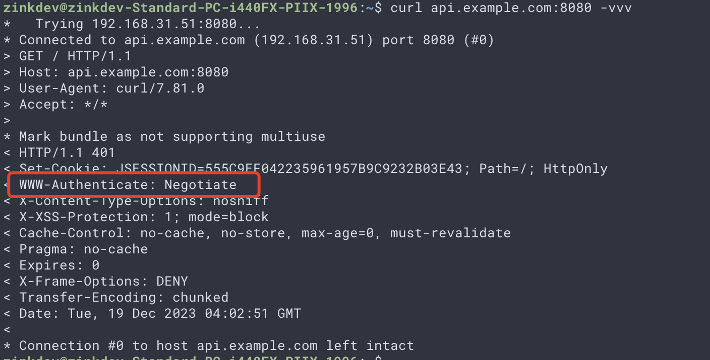

> 注意我这里将 api.example.com 解析到了另外一台机器上，模拟了单点登录中的多台机器的情形，但使用同一台机器做测试也没问题

curl 也可以直接启用 negotiate 认证，只需要输入

```bash
curl --negotiate -u: http://ldap.example.com:8080/home -vvv
```

如果一切顺利，curl 就能自动获取认证信息

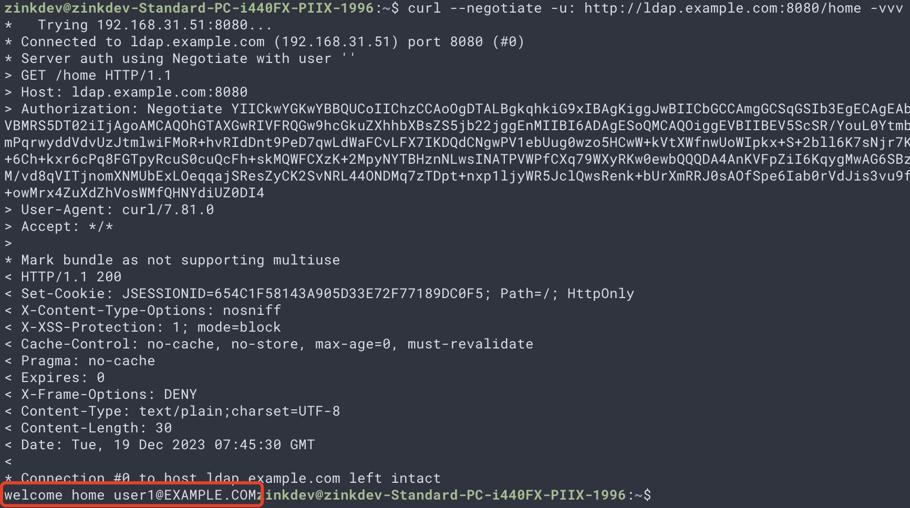

# Linux 下配置浏览器使用 Kerberos 认证

不同系统，不同浏览器配置 kerberos 的认证方式都不一样。

先说比较简单的 Linux。

> 注意，这一部分一般情况下不会由项目同学自己搭建，一般情况下这些基础环境都已经由客户方的运维搞定了，这里只做介绍，有兴趣的同学可以参考。

## Firefox

对于火狐，需要删除系统自带的版本（snap version），再下载官网的版本。

打开火狐后，在地址栏输入 about:config ，进入配置页面，搜索 network.nego 后，修改如下两项，将 example.com 添加到认证白名单中

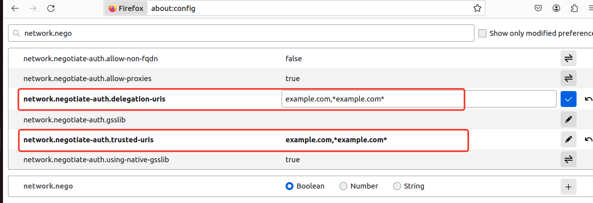

由于 Firefox 内置了 gssapilib，因此它直接能处理 Negotiate 的认证。

配置完后，重启 Firefox，在新的标签也中打开并输入网址 http://api.example.com:8080/home

此时应该能看到服务端的正常响应

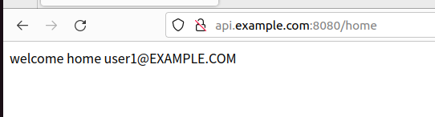

## Chrome

Chrome 配置 kerberos 稍微复杂一些。

首先需要安装 gsslib 

```bash
sudo apt install libgss-dev
```

随后需要配置 chrome 的 polices，要允许 chrome 使用系统自带的 gssapi 进行认证，同时要配置允许认证的白名单。

在 `/etc/opt/chrome/policies/managed` 目录下，新建一个 example.json 的文件，内容如下

```json
{
  "AuthServerAllowlist": "*.example.com*",
  "AuthNegotiateDelegateAllowlist": "*.example.com*",
  "DisableAuthNegotiateCnameLookup" : true,
  "EnableAuthNegotiatePort" :false ,  
  "GSSAPILibraryName": "libgssapi_krb5.so.2"
}
```

> 注意，在旧版本的 chrome 中，AuthServerAllowlist 和 AuthNegotiateDelegateAllowlist 名为 AuthServerWhitelist 和 AuthNegotiateDelegateWhitelist。可能是因为美国那边避讳了 black 和 white 的缘故...


如果配置正常，打开 chrome://policy 后应该能够看到自定义过的所有 Policies，如下：

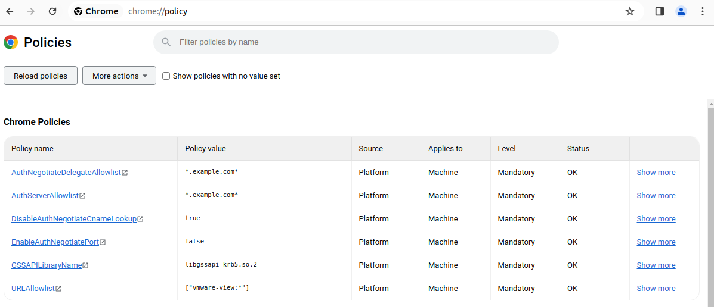

如果在 Status 一列中显示的不是 OK，而是 Invalid 或者 Error，那说明可能拼写错误，或者是 Policy 改名了，或者是 value 不正确，可以查看 chrome 自带的 policy 目录。

此时再打开 http://api.example.com:8080/home , 就能够正常访问了：

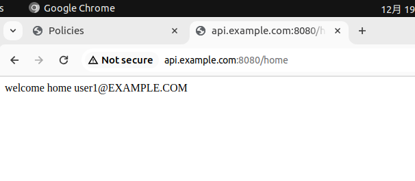

Chrome 对 Negotiate 的认证是对用户屏蔽的，因此你在控制台找不到该认证的请求。

# Windwos 下配置浏览器使用 Kerberos 认证

由于 Windows 下需要 Domain Controller 来发起一个 SPNEGO 认证，需要搭建 windows server + Active Directory + LDAP，并且要将电脑加入这个域中，稍微有点复杂。

暂时跳过这部分的配置，一般情况下，客户那边应该由运维搭建好基础环境，因此我们在实际工作中只要理解 SPNEGO 的认证原理即可。

参考资料

- https://www.chromium.org/developers/design-documents/http-authentication/

- https://docs.spring.io/spring-security-kerberos/docs/current/reference/html/index.html

- https://docs.spring.io/spring-security-kerberos/docs/current/reference/html/browserspnegoconfig.html

- https://chromeenterprise.google/policies/https://ubuntu.com/server/docs/kerberos-introduction

- https://superuser.com/questions/1707537/firefox-and-chromium-dont-do-kerberos-negotiation-curl-does

- https://ubuntu.com/server/docs/kerberos-introduction

