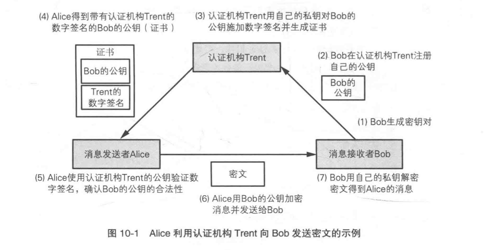

# Chap0. 说明

---

本文介绍的：

- 密码学中基本概念与技术
- 各种技术是解决什么问题的以及他们之间的关系
- 怎么用代码完成加解密，与开发相关的加密知识

没有提及的：

- 加密算法的具体实现
- 各种加密方式的漏洞与攻击方式

---

# Chap1. 密码

---

## 密码基础

### 对称密码公钥密码

1. 密码算法 = 加密算法 + 解密算法
2. 对称密码（公共钥密码，传统密码，私钥密码，共享秘钥密码）：对称加密
3. 公钥密码：非对称加密
4. 混合加密：对称密码 + 公钥密码

---

### 其他密码技术

1. 单向散列函数（one-way hash function）：用于计算**单向散列值**，用于验证**完整性**，可以检测是是否被篡改过。
2. 消息认真码(message authentication code)：提供**认证**机制
3. 数字签名(digital signature)：对数字签名进行**验证**，可以防止**伪装**、**篡改**、**否认**
4. 伪随机数生成器（Pseudo Random Number Generator，PRNG）：用于**生成**秘钥

---


---

## 历史上的密码

### 著名密码

凯撒密码（平移）

简单替换密码（替换）

Enigma（秘钥加密秘钥） - [《模仿游戏》](https://movie.douban.com/subject/10463953/)

---

## 对称加密 Symmetric Encryption

### 解决的问题

- 机密性

---

### 一次性密码本

使用 `异或 (XOR)` 就可以完成简单的加解密

```python
import os

key = os.urandom(4)
plain_text = "moon"

cipher_content = bytes([a ^ b for a, b in zip(plain_text, key)])

palin_text = bytes([a ^ b for a, b in zip(cipher_content, key)])
```

---

这种被称为一次性密码本，虽然能被暴力破解，但是**无法判断是否为正确的明文**

缺点：

内容有多大，秘钥就必须多长，因此他的配送和传输都有问题；并且安全性也很差

---

### DES（Data Encryption Standard）

> DES 不是一种算法，而是一个标准

---

#### 算法

DEA（Data Encryption Algorithm，数据加密算法）

DEA是一种将 64 bit（8 bytes) 明文加密成 64 bit 密文的堆成密码算法，他的秘钥长度是 64 bit （但是由于每隔 7 个 bit 就设置了用于错误校验的比特，因此实际长度为 56 bit)

> 问题：
>
> 1. 只能加密 8 字节？那我如何加密我的小姐姐呢？
> 2. 我要加密的东西不足 8 个字节，怎么办？

---

#### DES结构（Feistel 网络）

Feistel 网络 由 **轮** 构成

加解密时用任何函数作为轮函数都可以解密

---


每一轮都只加密左边的内容，右边的内容是不变的；但是可以在下一轮中左右交换；

---


而 DES 进行 16 轮这样的操作；

---

#### 3DES

就是进行三次的 DES 的加密？其实不准确，它的流程是：

1. 进行一次 DES 加密
2. 进行一次 DES **解密**
3. 进行一次 DES 加密

---


---

这样增加了兼容性，在三把 DES 秘钥都相同的情况下等于 **进行了一次 `DES` 加密**

如果 1、3 秘钥一样，2不一样，我们称为 `3DES-EDE2`

如果 1、2、3 三把秘钥都不一样，我们称之为 `3DES-EDE3`

---

### 现状

`DES` ：必须暂停使用，已经不安全。最新记录是 22 小时左右就可以破解 DES 加密

`3DES` ：不用与新用途，只用于兼容老项目

---

### AES(Advanced Encryption Standard)

> AES 不是一种算法，而是一个标准

---

#### 算法

AES 是 `美国标准技术研究所（NIST）` 公开竞选的，最后竞争的算法和排名为：

- Rijndael  `# 1`
- Serpent `# 2`
- Twofish  `# 3`
- RC6 `# 4`
- MARS `# 5`

---

所以我们一般说的 AES 加密，实际上是使用 [`Rijndael算法`](https://blog.csdn.net/chengqiuming/article/details/82192882) 进行的加解密操作。

但实际上呢，其他算法也是可以用的，毕竟都是选拔过的，经过了多方认证，一些强度比较弱的已经被淘汰了。只不过 `Rijndael算法` 获胜了而已。

---

并且，`Rijndael算法` 也不再将秘钥局限在 64 bit, 他提供了 `range(128, 256, 32)` 范围内的秘钥长度

不过标准的 AES 只提供 128 、 192 和 256 位秘钥的三种，被称为：

- `AES-128`
- `AES-192`
- `AES-256`

---

### 遗留的问题

- 秘钥交换问题 - 如果秘钥泄露，那所有人都可以加解密

> 秘钥 == 明文

---

在进入下一章时，让我们先来解决刚才提的问题

---

### 分组密码模式

#### 分组加密（Block Cipher）

对于 DES 和 AES （包括 RSA）来说，他们都是 **分组密码**，只能使用 `分组加密（Block Cipher）` 的形式进行加密

即，将需要加密的内容进行切割，然后再对切割后的分组进行迭代，这种迭代的方式称为 `模式(模式)`

---

#### 模式（mode）

- ECB `Electronic CodeBook` 电子密码本模式
- CBC `Cipher Block Chaining` 密码分组链接模式
- CFB `Cipher FeedBack` 密码反馈模式
- OFB `Output FeedBack` 输出反馈模式
- CTR `CounTeR` 计数器模式

---

##### ECB


不安全，并且可以被单独解密

> 来试试看用AES-128-ECB模式加密一个都是空格的文件

```sh
$ printf ' %.0s' {1..100} > test.txt
$ openssl enc -e -aes-128-ecb -in test.txt -out test.bin
$ cat test.bin
```

---

##### CFB


IV: Initialization vector  初始化向量

一次性密码本与流密码：流密码还是计算出来的，因此还不具备不被破解的特性

---

#### 填充（padding）

对于分组密码来说，有一些模式需要让明文分组满足一定数量的字节，这里就引入**填充padding**

> 比如使用 AES-128-ECB 来进行加密时，不满足 128 位（即 16字节）的部分，就要使用填充来进行

填充的算法可以有：

- `PKCS#7`
- `ANSIX923`

其实也可以用 `0` 进行填充，不过安全性欠佳？

> 因此在我们写代码的时候，如果遇到 ECB 和 CBC 模式，不仅要知道秘钥，还要知道具体的填充算法

---

> [PKCS](https://en.wikipedia.org/wiki/PKCS)：*Public Key Cryptography Standards* 是一种标准
>
> > PKCS#7：类似与 pep8，是这个标准里面的子项，它实现了一种填充算法
>
> ANSI：美国国家标准学会 是一个机构
>
> > ANSIX923：也是一种填充标准算法的标准

---

### 补充

还有一种基于 `CTR` 的模式 `GCM`：他其实比较常见，它不仅完成了分组加密的迭代，还完成了数据的 **完整性校验**

---

### 总结


- 不能使用 ECB
- 不知道用什么的话就用 CBC （这是 openssl 里面默认的模式）

```sh
$ openssl enc -e -aes256 -in xxx.text -out xxx.bin
enter aes-256-cbc encryption password:
```

---

openssl 支持的加密

```sh
$ openssl enc -list

Supported ciphers:
-aes-128-cbc               -aes-128-cfb               -aes-128-cfb1
-aes-128-cfb8              -aes-128-ctr               -aes-128-ecb
-aes-128-ofb               -aes-192-cbc               -aes-192-cfb
....
```

> 省略的特别多，自己看吧

---

## 公钥加密

### 解决的问题

- 秘钥交换问题

---

### 算法

- RSA
- ElGamal
- Rabin
- ECC（椭圆曲线密码）（它可以做到比RSA秘钥长度短）

数学基础：

- 大素数分解问题类：两个大素数的乘积很难再拆分为两个大素数；
- [离散对数](https://baike.baidu.com/item/离散对数/4538780)问题类：离散对数的逆运算没有高效的算法；
- 椭圆曲线类（也是一种离散对数的问题）：椭圆上两个点特殊乘法逆运算非常困难；

---

### RSA

> RSA 是一个算法，它是由 RSA 公司开发的

$$E=公钥 \\\\
D=私钥 \\\\
N=p*q \\\\
密文=明文^E{\\bmod}N \\\\
明文=密文^D{\\bmod}N$$

RSA 一般秘钥的长度为 `1024 2048 4096`

> RSA-3072 具备 AES-128 同等的抗暴力破解能力

---

### 填充 padding

问题：对相同内容加密获得的密文是一样的？

使用填充，RSA填充的随机性可以让加密内容每次看上去都不一样

- PKCS1v15
- OEAP（PKCS1v2）(`Optimal Asymmetric Encryption Padding` 最优分对称加密填充)

关于填充还少不了这两兄弟：

- PSS （用于签名）
- MGF1（`掩码生成函数1` 被用作PSS和OAEP填充中的掩码生成函数。）

> 没有填充的RSA被称为 Textbook RSA；

> RSA加密在没有填充的情况下已经被证明是不安全的

---

RSA 也是一种 **分组密码**

对于RSA来说，使用填充会对每一组加密的内容进行填充。因此需要牺牲部分字节来换取填充的空间；

这里列举一下填充需要牺牲的字节

- PKCS1v15: `$key_size // 8 - 11`
- OEAP: `$key_size // 8 - 2 * ($hash_function_output_size // 8)`


> 比如 `RSA-1024-PKCSv1_15` 它最长可以加密 `1024 // 8 - 11 = 117` 字节的数据

> 比如 `RSA-1024-OEAP + SHA256` 它最长可以加密 `1024 // 8 - 2 - 2 * (256 // 8) = 190` 字节的数据

---

### 遗留的问题

- 速度（公钥加密速度比对称加密速度慢百倍）
- 公钥交换问题（中间人攻击）
- 公钥验证问题 - 如何验证公钥没有被替换？
- 在网络传输中如何验证发送数据的 **完整性**

---

## 混合加密

解决了速度的问题，用公钥密码加密对称密码

---

# Chap2. 验证

---

## 单向散列函数（哈希函数）


生成的序列也被成为 **指纹**

### 解决的问题

- 信息的 **一致性**， 或者说 **完整性**

---

### 特性

- 散列值固定
- 快速计算
- 消息不同，散列值不同（抗碰撞性）
- 单向性

---

### 算法

- MD4、MD5（均不安全，MD为 Message Digest 缩写）
- SHA-1（2005年被山东大学王小云团队攻破）、SHA2（SHA-256、SHA-384、SHA-512）（SHA是Secure Hash Algorithm的缩写）
- RIPEMD-160（比特币）
- SHA-3（2015年才由NIST发布，为Keccak算法，还有SHAKE算法）

> 其中 SHA-256 代表使用该算法输出的长度 (256比特 32字节)

> SHA-3 的 Keccak 算法将不再限制输入的大小，同样的，SHAKE算法

> 碰撞攻击算法：即能找到可以生成一样哈希值的信息

---

### 盐

在单向散列函数中，还有一个 *盐(salt)* 的概念

**盐**： 在散列之前将散列内容的任意固定位置插入特定的字符串

如 `admin` 信息太短，很容易被 **彩虹表** 破解。

我们可以给他加一点盐再生成对应的散列值，如 `adminabcdefgxyz` 也可以是 `aabcdefgmxyzin`

盐是公开的

---

盐可以用来生成 **基于口令的秘钥**，其中标准的算法为 `pbkdf2` `Password based key derivation function 2 (PKCS #5 v2.0)`

```python
from hashlib import pbkdf2_hmac

pbkdf2_hmac(hash_name='sha256', password=b'admin', salt=b'sdfsdfsdfdsfa', iterations=150000)
```

---

### 应用

- 摘要(指纹)
- 基于口令的加密
- 消息认证码（秘钥 + 哈希函数）
- 数字签名
- 伪随机数生成器
- 一次性口令

---

### 遗留的问题

- 无法辨别 **伪装**

---

## 消息认证码

(又一个) MAC（Message Authentication Code）

**MAC 是一种与秘钥相关联的单向散列函数**


### 解决的问题

- 确认接受的密文没有被**伪装**

---

### 具体标准/算法

- HMAC（使用SHA-2之类的**单向散列函数**）
- AES-CMAC （基于 **分组密码** 如 `AES_CBC`）
- ...

---

#### 认证加密 (AEAD)

`AEAD（Authenticated Encryption with Associated Data）` （微信支付回调信息）

将对称密码与消息认证码将结合，同时满足机密性、完整性、认证三大功能；

`GCM` （Galois/Counter Mode）模式就是这种方式，它基于 `AES-128-CTR`，并时有一个反复进行加法和乘法的散列函数来计算 MAC 值。

> 因此在`GCM`模式下，还必须传入参数 `associated_data` 进行校验
> 
> 同时，为了防止重放攻击，还必须传入 `nonce` 值

---

#### HMAC

**H** - Hash

**使用单向散列函数构造消息认证码的方法**

使用 `SHA256` 构造的 HMAC 称为：`HMAC-SHA-256`

---

### 应用

- SWFIT（环球银行金融电信协会）
- IPSec（IP协议的增加安全性的方式之一，在该协议下，消息认证码用来完成内容认证和完整性校验）
- SSL/TSL

---

### 遗留的问题

- 无法让第三方证明
- 继而无法防止否认

> 由于使用对称的秘钥生成的HMAC，双方都可以完成这个操作，就无法防止否认了

---

## 数字签名

### 解决的问题

- **否认**

> 由于每个人都用自己的秘钥生成签名，其他人无法伪造

签名代表 **认可该消息的内容**，由加密者完成

验签代表 **验证该消息是否可靠**， 由解密者或者第三方验证者完成

---

### 具体标准/算法

```text
加密：

任何人 **都能加密**，**只能由接受者** 解密
```

签名做的事情正好和加密相反

```text
签名：

**只能由自己生成**，任何人都 **都能验证**
```

因此使用**公钥密码算法**来完成签名和验签

---

对于签名的内容，一般是加密后消息的 **散列值**

> 所以说
> 公钥加密消息，私钥签名(加密散列值)
> 私钥解密消息，公钥验签(解密散列值)

---


---

### 应用

- 安全信息公告（明文公告，验证发布信息者的有效性）
- 软件下载（安装开发者签名正确的软件，IOS、安卓开发）
- 公钥证书（对公钥进行数字签名 -- 公钥证书）
- SSL/TSL（服务器证书 -- 也是公钥证书的一种）

---

### 遗留的问题

- 公钥验证问题（防止中间人攻击）

---

## 证书（公钥证书）

公钥证书记录姓名、组织、邮箱、地址等等个人信息，并由 **认证机构** （CA）施加数字签名。



---

当然，证书里面肯定是包含秘钥的，可以是公钥，也可以是私钥，也可以是秘钥对

证书有 `Der` 格式和 `Pem` 格式

---

### 解决的问题

- 公钥的认证与颁发

### 公钥基础设施(PKI)

- 用户
- 认证机构
- 仓库

> 还有很多，比如证书的作废（CRL），证书的层级关系等等，欢迎大家自己去了解

---

### 一些规范

- X.509 证书的格式规范（RFC3280）
- PKCS#5 基于口令的加密标准
- PKCS#10 用户自己生成秘钥对，则需要认证机构来生成证书，申请证书的规范就是 `PKCS#10` 来规定的
- PKCS#12 如果秘钥对由CA颁发，需要将用户的秘钥对颁发给用户，如何颁发就由 `PKCS#12` 来规定，它使用基于`PKCS#5` 的来进行基于口令的加密秘钥
- PKCS#8 如何加密**私钥**的语法，由 `PKCS#8` 来规定，它使用基于`PKCS#5` 的来进行基于口令的加密秘钥

[完整的PKCS](https://www.cnblogs.com/saintaxl/archive/2012/01/03/2311291.html)

---

# Chap3. 其他

---

## 随机数

### 伪随机数需要具备的特性

- 随机性
- 不可预测性
- 不可重现性

> 越往下越严格

---

### 伪随机数生成方法

- 杂乱函数
- 线性同余法
- 单向散列函数法
- 密码法
- ANSI X9.17 / ANSI X9.31 (DES / AES)
- 其他算法

---

### `random` 模块和 `os` 模块

- `random` 是伪随机数算法，需要设置种子，不能用于加密作用

- `os.urandom(n)`，是系统级别的随机数，根据系统中的[`/dev/urandom`](https://zh.wikipedia.org/wiki//dev/random)中的字节流进行创建，这里的字节是CPU根据环境噪声等信息进行生成的

---

## SSL/TLS

略

---

## cryptography

推荐使用 `cryptography` 作为加解密的包

### 使用原因

1. 唯一 不存在冲突
	
	> crypto / pycrypto / pycryptodome 傻傻不清楚
	
2. 基于OpenSSL 兼容性强

---

### cryptography.fernet.Fernet

简单用法

是对称加密，他基于：

- AES-128-CBC; using PKCS7 padding.

- HMAC using SHA256 for authentication.

- Initialization vectors are generated using os.urandom().

---

```python
from cryptography.fernet import Fernet

key = Fernet.generate_key()
f = Fernet(key)
token = f.encrypt(b"my deep dark secret")
token
b'...'
f.decrypt(token)
b'my deep dark secret'
```

---

#### cryptography.x509

加载证书相关

---

#### cryptography.hazmat.primitives（核心）

密码学原语，在这里你可以找到刚才我们提到的任何一种加密算法

- cryptography.hazmat.primitives.ciphers 对称加密相关
- cryptography.hazmat.primitives.asymmetric 非对称加密相关
- cryptography.hazmat.primitives.serialization 序列化公私钥相关
- cryptography.hazmat.primitives.hmac HMAC相关

---

## 示例代码

### 基于口令的密码

```sh
openssl enc -aes128 -in xxx -out xxx
```

### 登录加密

同 Fernet 使用方法

---

### 微信支付

[微信支付的回调](https://wechatpay-api.gitbook.io/wechatpay-api-v3/qian-ming-zhi-nan-1/zheng-shu-he-hui-tiao-bao-wen-jie-mi)是基于 GCM 模式的 AES-256 加密

> 微信支付也涉及证书与签名，大家有兴趣可以去看看文档

---

```python
from cryptography.hazmat.primitives.ciphers.aead import AESGCM

api_key = ''  # 由微信颁发

aesgcm = AESGCM(api_key)

callback_message = {
        'id': 'xxx',
        'create_time': 'xxx',
        'resource_type': 'encrypt-resource',
        'event_type': 'TRANSACTION.SUCCESS',
        'summary': '支付成功',
        'resource': {
            'original_type': 'transaction',
            'algorithm': 'AEAD_AES_256_GCM', # 加密算法
            'ciphertext': 'xxxxxxx', # 加密数据
            'associated_data': 'transaction',
            'nonce': 'xxxxx'
        }
    }  # 微信支持回调信息

aesgcm.decrypt(call_back_message['resource']['nonce'],
            call_back_message['resource']['ciphertext'],
            call_back_message['resource']['associated_data'])
```

---

### 使用证书加解密样例

- 由CA颁发秘钥对给A，A解密后拿到公钥私钥
- 使用B公钥对文件进行加密，并且用A私钥进行签名
    - 加密方式：规定使用RSA进行加密，并且使用 PKCS1v15 进行填充
    - 签名方式： SHA1 算法生成散列值，并且对散列值进行RSA加密，使用 PKCS1v15 进行填充
- B用自己的私钥解密，并且用A的公钥进行验签

---

[加密代码](CAEncrypt.py)

[解密代码](CADecrypt.py)

见附件

---

# chap4. 总结

---


