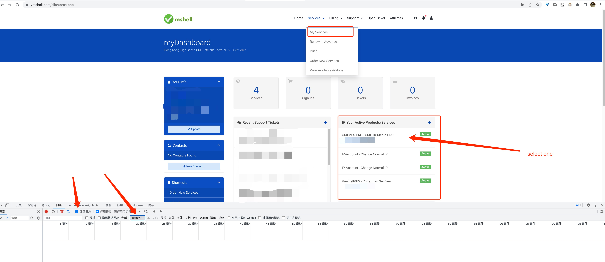
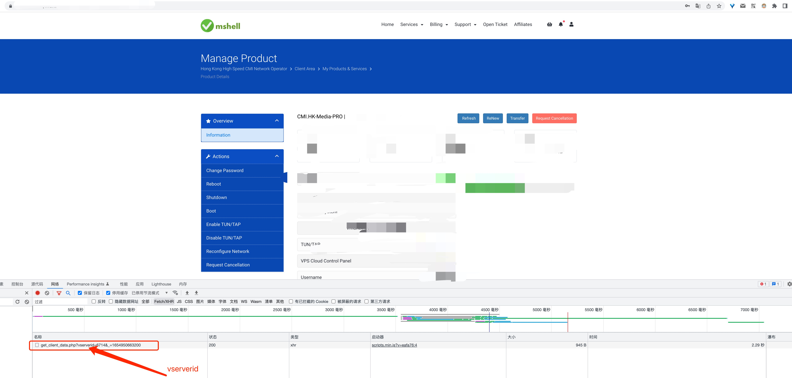

源码地址：https://github.com/ZinkLu/TGRobot

# 1. 背景

最近发现 TG 这个软件真的很好用，我并不关注什么隐私之类的。如果隐私是一件衣服的话，现在所有人的底裤都被扒了。

我是纯粹感觉里面功能十分清爽， SVG 动画也做得很酷很流畅；

不过最最重要的是，他对机器人的支持很友好。创建和开发都十分简单，github上也有不同语言封装的SDK，而且机器人几乎能做和人一模一样的事（甚至更多）。我看过有拿机器人来做进群校验的，有搜歌的，搜片的，也有搜图的。（为啥国内的这些聊天平台这么不开放呢。）

所以我也抽空写了一个简单的电报机器人，可以帮助来做一些事情（当然，我这里出发点是为了去管理[vmshell服务器](https://vmshell.com/)）。

> PS: inline_keyboard 真的挺强大的，甚至可以搞一个简单的基于文本+选项的游戏了

# 2. 构建

需要用到 go 1.18

```bash
git clone git@github.com:ZinkLu/TGRobot.git && cd TGRobot && go build
```

# 3. 如何使用

## 3.1 启动

要启动机器人，需要一个适当的配置文件，查看[config](##config)部分以获得更多细节。

命令。

```bash
./TGRobot -c config.yaml
```

## 3.2 配置

config 文件是一个有效的 yaml 格式文件或 json 格式文件。

> 推荐 yaml，能写注释

```yaml
apiToken: xxx
debug: false
handlers:
    message_handler:
        vmShell: xxx
        anotherMessageHandler: xxx
    inline_keyboard_handler:
        xxx: Xxx
    picture_handler:
        xxx: xxx
    ...
```

- `apiToken`: 机器人Token，可以从[@botfather](https://t.me/botfather)获得。

- `debug`: 如果设置为 `true`，将记录更多的信息。

- `Handlers`: 这部分应该包括不同的 handlers 的配置，详见[项目结构](#51-代码结构)

我也写了一些 handlers，可以直接使用

# 4. 内置 Handler

## 4.1 VmShell Handler

vmShell handler 当前可以获取服务器的信息，后面希望可以完成对服务器的简单操作（重启等，也可以执行一些指令）

### 4.1.1 配置

vmshell 是一个message handler，但也是一个 inline-keyboard handler，由于它处理的是原始的对话信息，我们把它放在 `message_handler` 中。

```yaml
handlers:
    message_handler:
        vmShell:
            username: vmshellAccount
            password: vmshellAccountPassword
            serverIds:
                - xxx
                - xxx
```

- `handers.message_handler.vmShell`:
    - `username`: vmshell 账户
    - `password`: vmshell 密码
    - `serverIds`: 想控制的服务器id

> 警告!
> 
> 要不开启双重认证（google auth）
> 
> 除非vmshell服务器可以通过apiToken访问，据他们客服说的，apiToken正在开发中。

#### 4.1.2 如何获取serverId

1. 打开你的服务列表

2. 按`F12`打开开发控制台

3. 记得选择 `preserve log` 和 `Fetch/XHR`。

4. 选择一个服务器，见下图。

    

5. 然后你的控制台应该会显示一个包含 `serverId` 的XHR请求。

    

### 4.1.3 用法

目前，vmshell handler 可以处理的信息有：

- `流量`：获取服务器带宽使用情况

- `服务器`：获取服务器信息

只要向机器人发送任何带有上述关键词的信息，就可以执行对应的动作。

### 4.1.4 TODO

- [x] 将serverId改为serverIds，这样我们就可以控制多个服务器。

- [ ] 如果serverIds是空的，那机器人会自动获取。

## 4.2 一言 Handler

一言处理程序不需要任何配置。

### 4.2.1 用法

发送 `一句话` 给机器人来获取你的一言。

特别感谢 [hitokoto.cn](https://hitokoto.cn/) （本网站的404也是由一言驱动的）

## 4.5 Tgo Handler

Tgo Handler 可以通过 gRPC 和 [Tgo API](https://p4gefau1t.github.io/trojan-go/advance/api/) 通讯，从而拿到用户信息。

> 当前只支持查询，不支持新增修改删除。

### 4.5.1 配置

Tgo Handler 也是一个 `message_handler`:

```yaml
handlers:
    message_handler:
        Tgo:
            api_addr: "127.0.0.1"
            api_port: 1444
```

- `handers.message_handler.Tgo`:
    - `api_addr`: grpc API's host
    - `api_port`: grpc API's port

> 当前只支持不带证书的 gRPC 链接

### 4.5.2 用法

给机器人发送 `我的流量`，这时机器人会要求你输入密码。

选中机器人的这条信息，然后点击回复信息，再输入密码后再发送。

如果密码正确，就可以显示用户用量：

```text
USAGE           ⏳184.61MB(0.18Gb).
SPEED           ⬆️0.00kb/s, ⬇️0.00kb/s
SPEED LIMIT     ⬆️0.00kb/s, ⬇️0.00kb/s
ONLINE DEVICE   💻 0(current) 0(total)
```

查询成功后密码会被缓存，因此下次直接发送 `我的流量` 即可重新查询。

### 4.5.3 TODO

- [ ] 支持安全的 gRPC 链接
- [ ] 支持管理员密码，能对用户进行进一步管理

# 5. 添加自定义处理程序

在编写代码之初，我就不希望这个机器人只能处理某一种问题，比如只能控制服务器。

而是通过责任链 (Chain of Responsibility) 来串联同类的 Handler。

> 因此 message handler 和 inline_keyboard handler 是两条责任链。不同类型的 handler 互不影响。

如果想给机器人添加一些额外的 handler 也很方便。

>（不过很多类型的 handler 还没有创建好基类）。

## 5.1 代码结构

由于 Telegram 有许多消息类型，源代码的结构是为了处理不同类型的消息而排布的。

每个文件夹都是一个 handler，我们称这些真正处理消息的 handler 为 app handler（应用程序）。

```text
├── handlers
│   ├── handlers.go
|   ├── register.go
│   └── message_handler
│       ├── message_handler.go
│       └── vmshell
│           ├── config.go
│           ├── server_info.go
│           ├── vmshell_client.go
│           ├── vmshell_client_test.go
│           └── vmshell_handler.go
|   ├── inline_keyboard_handler
|   ├── video_handler(not implement)
|   ├── command_handler(not implement)
```

## 5.2 自定义 App Handler

假设现在要添加一个 message handler，用于获取本地天气。

现在 `handlers/message_handler/` 下创建 weather 文件夹。

## 5.3 定义 Config

我们希望获取本地天气，因此需要在配置里面配好所在的城市，所以我们在 `handler.message_handler` 下加一个 mapping 。

```yaml
apiToken: xxx
debug: false
handlers:
    message_handler:
        weather:
            city: Shanghai
```

别担心，一会这个配置会传到 Handler 里面，不需要额外的操作。

## 5.4 定义 Handler

一个 Handler 必须要符合 `common.AppHandlerInterface` 接口

```golang
type AppHandlerInterface interface {
	Handle(*tgbotapi.Update, *tgbotapi.BotAPI) // 真正的处理方法
	When(*tgbotapi.Update) bool // 如果返回true，则可以执行 Handle ，否则就 fallback 到下一个 handler
	Init(*config.ConfigUnmarshaler) // 程序会调用 Init 方法，并且把配置项传进来
	Order() int // 越小代表 handler 越先执行
	Help() string // 帮助信息，如果所有的 handler 都无法处理消息，bot 会发送所有已经注册的应用程序的帮助信息。
	Name() string // 应用程序名称，不能重名，否则会panic 
}
```

我们来实现一个 WeatherHandler，为了能使用刚才的yaml中的配置文件，我们定义一个 struct 来与之对应

```go
package weather

type Config struct {
	City string `configKey:"city"`
}
```

本项目支持 json 和 yaml 两种配置文件格式，提供了新的 tag 来 unmarshal 对象，因此，我们可以来定义下 Init 方法

```go
func (w *WeatherHandler) Init(conf *config.ConfigUnmarshaler) {
	wConf := &Config{}
	conf.UnmarshalConfig(wConf, w.Name())
	w.City = wConf.City
}

func (w *WeatherHandler) Name() string {
	return "weather"
}

func (w *WeatherHandler) Order() int {
	return 999
}

```

`*config.ConfigUnmarshaler` 的 `UnmarshalConfig` 方法会自动将 `handler.message_handler` 下的所有配置传给你，只需要 unmarshal 你关心的 Key（这里是 weather）

我们顺便设置了 Order，这个方法也会影响 Help 信息显示的顺序。

现在可以设置应用程序的触发条件，我们处理所有包含`天气`的信息（前提是消息没有被其他 handler处理）：

```go
func (w *WeatherHandler) When(u *tgbotapi.Update) bool {
	return strings.Contains(u.Message.Text, "天气")
}

func (w *WeatherHandler) Help() string {
    return "对我说, '天气'"
}
```

> `u.Message` 虽然是一个指针，不过可以放心大胆的 `u.Message.Text` ，也不用害怕空指针的问题，因为 message Handler 的触发条件必须是 message 不为空。

现在，可以定义真正的 Handle 方法了，让我们写一段伪代码

```go
func (w *WeatherHandler) Handle(u *tgbotapi.Update, bot *tgbotapi.BotAPI) {
	URL, _ := url.Parse(WEATHER_PROVIDER_URL) 
	URL.Query().Set("City", w.City)
	resp, _ := http.Get(URL.String())
	content, _ := ioutil.ReadAll(resp.Body) // 根据实际情况查询
	m := tgbotapi.NewMessage(u.Message.Chat.ID, string(content))
	bot.Send(m)
}
```

## 5.5 注册 Handler

为了启用 Handler，需要将 Handler 注册到他上级的 Handler 中，这里上级 handler 是 `message_handler`，直接在 init 方法中直接使用 `message_handler.Register` 方法

```go
func init() {
	message_handler.Register(&WeatherHandler{})
}
```

最后，在 `handlers.go` 文件中导入即可，这是所有 handler 的入口

```go
package handlers

import (
    _ "github.com/ZinkLu/TGRobot/handlers/message_handler/weather"
)
```

这样就 OK 了，不出意外机器人就能处理你的信息了。

## 5.6 获取其他 Handler

有时候，一个 app handler 可以依赖其他 handler，比如一个 inline_message handler 可能是被 message handler 触发的，他需要这个 message handler 中的配置文件来处理。

在 `pool.GetAppHandlerByName` 中，可以获取一个已经被注册的 handler，如果这个 handler 没有被注册，则程序可能 panic。

```go
message_handler := pool.GetAppHandlerByName[*vm_message.VmShellHandler]("vmShell")
message_handler.Config.serverIds // get info
```
