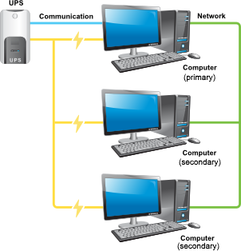

# 1. NUT 是什么？

NUT 全称是 Network UPS Tools，即 **网络UPS工具**，它的作用是提供服务来让网络中的计算机了解当前 UPS 的状态，并在 UPS 电池耗尽之前执行关机以确保数据的安全。

值得注意的是，不是所有的UPS都支持这个功能。在购入 UPS 前需要查看它支不支持与计算机通讯，且有完备的驱动。

# 2. NUT 中重要的概念（软件的分层）

- **drivers** - 和硬件交互: `upsdrvctl + ups.conf`
- **server** - 提供硬件状态的接口: `upsd + upsd.conf/upsd.users`
- **clients** - 查询server的能力: `upsc`
- **cgi-bin** - 基于web 的客户端（需要自己编译，并加上 `--with-cgi` 的flag）
- **scripts** - 特定情况下触发的脚本: `upsmon + upsmon.conf/upssched.conf`

其他的软件：
1. upslog: 查看监听日志
2. upscmd: 运行UPS内置命令（需要UPS支持，使用 `upscmd -l` 来查看; 需要upsd.users 授权用户才能执行）

# 3. NUT的运行模式

[详见文档](https://networkupstools.org/docs/user-manual.chunked/ar01s03.html)

我这里采用了 "Advanced" 模式，如下




# 4. NUT 配置步骤

## 4.0. 安装 NUT 工具

```bash
sudo apt install nut
```

## 4.1. 配置 NUTdriver

1. 扫描

   ```bash
   nut-scanner -q
   
   [nutdev1]
   	driver = "usbhid-ups"
   	port = "auto"
   	...
   ```

2. 复制上述内容至`/etc/nut/ups.conf`，或者直接

   ```bash
   sudo nut-scanner -q >> /etc/nut/ups.conf
   ```

   建议把UPS名字换了，换一个好记一点的，我就换成了 `APC` ，正是我买的这个UPS的品牌

   ```bash
   [APC]
   	driver = "usbhid-ups"
   	port = "auto"
   	...
   ```

3. 开启 nut-driver

    ```bash
    sudo systemctl start nut-driver
    # 或者
    sudo upsdrvctl start APC # 这里是配置文件中的UPS名称
    ```

## 4.2. 配置 upsd 并启动

1. 修改配置

   可以选择配置 `etc/nut/upsd.conf` 但我全留了默认值，因此它只监听`localhost:3493`

2. 配置 upsd 用户 `/etc/nut/upsd.users` （在后面用得到）

    ```bash
    [upsmon]
            password = "xxxx"
            upsmon master
    ```
3. 启动uspd

    ```bash
    sudo upsd
    ```

## 4.3. 查看UPS状态

1. 查询所有状态

   ```bash
   upsc APC@locahost
   ```

2. ups.status

   ```bash
   upsc APC@locahost ups.status
   # OL
   ```

   OL: line power（使用外部供电）

   OB: on battery （使用电池供电）

   LB: low battery （电量低）

## 4.4. 配置NUT自启动

   修改 `/etc/nut/nut.conf`

   ```bash
   MODE=netserver
   ```

   > 特别老的版本好像是没有此配置的，需要手动配置.serivce文件

## 4.5. 设置自动关机 和 低电量事件

### 5.1 NUT Flow（当停电以后发生了什么？）

1. UPS 断电并使用电池供电；

2. UPS 电池电量即将耗尽（此时 `ups.status: OB LB`）；

3. master `upsmon` 监听到这一事件，并且设置 `FSD(forced shutdown)` 的标识来告诉所有的 slave 准备关机；

4. slave 收到 `FSB` 信号，它会：
    1. 触发 `NOTIFY_SHUTDOWN` 事件
    2. 等待 `FINALDELAY` 秒（一般来说5秒）
    3. 执行 `SHUTDOWNCMD` 脚本
    4. 断开与 `upsd` 的链接

5. master `upsmon` 最多等待 `HOSTSYNC` 秒（通常是15秒），让辅助系统断开与 upsd 的链接。如果在这段时间后仍有任何连接，`upsmon` 就会停止等待并继续后续操作。

6. master 收到 `FSB` 信号，它会：
    1. 触发 `NOTIFY_SHUTDOWN` 事件 
    2. 等待 `FINALDELAY` 秒（一般来说5秒）
    3. 创建名为 `POWERDOWNFLAG` 的文件（通常叫 `/etc/killpower`）
    4. 执行 `SHUTDOWNCMD` 脚本

7. `init` 准备回收系统资源，关闭进程、卸载挂载等；

8. `init` 执行关机的脚本。此时会去检查 `POWERDOWNFLAG` 文件，并告诉 UPS 关闭供电；

9. 整个系统的电力供给完全停止；

10. 随着时间推移，电力恢复，UPS 重新开启；

11. 所有系统重启；

### 5.2 配置关机策略

1. 先创建 upsd 用户（刚才创建过了）

2. 配置 `/etc/nut/upsmon.conf`
    1. 添加断电标志文件 `POWERDOWNFLAG /etc/killpower`
    2. 添加对upsd的监控 `MONITOR APC@127.0.0.1 1 upsmon xxx master`
        - 这里的 1 指的是 "power value"，应该一直被设置为 1，除非你正在管理一个非常昂贵、拥有冗余供电的系统
    3. 定义关机脚本 `SHUTDOWNCMD "/usr/sbin/shutdown -h +0"`
    4. 开启 `upsmon` 服务: `upsmon` 或者 `systemctl start nut-monitor`


### 5.3 高级应用

1. 原理
    设置 `NOTIFYFLAG $type $action` 来让 `upsmon` 监听特定的事件，然后执行特定的动作。
    其中
    已知的 type 为 `ONLINE`, `ONBATT`, `LOWBATT`, `FSD`, `COMMOK`, `COMMBAD`, `SHUTDOWN`, `REPLBATT`, `NOCOMM`, `NOPARENT`,
    已知的 Action 为 `WALL` `SYSLOG` `EXEC` `IGNORE`

2. 关于 action
    - `WALL`: 给所有已登录的用户发送内容为 `NOTIFYMSG` 的消息
    - `SYSLOG`：记录日志
    - `EXEC`：执行 `NOTIFYCMD` 中配置的脚本。同时，他会设置 `UPSNAME` 和 `NOTIFYTYPE` 两个环境变量
    - `IGNORE`：啥也不干

    为了获取更加高级的功能，我们可以将 `NOTIFYCMD` 设置为 `/usr/sbin/upssched`，这样我们需要配置 `upssched.conf`

    因此，`upsmon.conf` 中的配置可以为

    ```bash
    NOTIFYCMD /usr/sbin/upssched
    
    NOTIFYFLAG ONLINE SYSLOG+EXEC
    NOTIFYFLAG ONBATT SYSLOG+WALL+EXEC
    NOTIFYFLAG LOWBATT SYSLOG+WALL+EXEC
    ```

3. `upssched`: 针对某个 `NOTIFYFLAG` 执行脚本、开启定时任务，我们至少要配置：
    1. `CMDSCRIPT`: 定时器所要触发的脚本，最好是`case ... esac`的结构的脚本，所有的定时器都只会执行这一个脚本；
    2. `PIPEFN`: 这个文件将在进程之间传递通信，以启动和停止定时器；
    3. `LOCKFN`: 这个文件被当做锁，防止定时器在某些状态下由于并发而产生的竞争。
    4. `AT` 定时器:
        - `AT ONBATT * START-TIMER onbattwarn 30` 监听所有 ups(*) 的 `ONBATT` 事件，如果有事件发生，设定一个每 30 秒执行一次的，名为 `onbattwarn` 的定时器
        - `AT ONLINE * CANCEL-TIMER onbattwarn` 监听所有 ups(*) 的 `ONLINE` 事件，如果有事件发生，取消一个名为 `onbattwarn` 的计时器
        - `AT ONLINE * EXECUTE ups-back-on-power` 监听所有 ups(*) 的 `ONLINE` 事件，立即执行 `CMDSCRIPT`，并将 `ups-back-on-power` 以参数的形式传递
        > 注意：timer 在执行的时候会讲自己的名字作为参数传给脚本
    5. 一个 `CMDSCRIPT` 的示例：
        ```bash
        #! /bin/sh
        case $1 in
                onbattwarn)
                        # Send a notification mail
                        echo "The UPS has been on battery for awhile" \
                        | mail -s"UPS monitor" bofh@pager.example.com
                        # Create a flag-file on the filesystem, for your own processing
                        /usr/bin/touch /some/path/ups-on-battery
                        ;;
                ups-back-on-power)
                        # Delete the flag-file on the filesystem
                        /bin/rm -f /some/path/ups-on-battery
                        ;;
                *)
                        logger -t upssched-cmd "Unrecognized command: $1"
                        ;;
        esac
        ```

### 5.4 我的配置

先来看下我的需求：

1. 当 UPS 启动电池供电时，记录日志并且发送 pushdeer 的通知
2. 当 UPS 恢复供电时，发送 pushdeer 的通知
3. 当 UPS 的电池电量少于 50% 时，发送 pushdeer 的通知 (TODO)
4. 当 `NOTIFY_SHUTDOWN` 事件被触发，准备关机时，发送 pushdeer 的通知。（master和slave都要配置）(TODO)

为了满足上述需求，我们可以对下述配置文件行进修改

`upsmon.conf`

```bash
NOTIFYCMD /usr/sbin/upssched

NOTIFYFLAG ONLINE SYSLOG+EXEC
NOTIFYFLAG ONBATT SYSLOG+WALL+EXEC
NOTIFYFLAG LOWBATT SYSLOG+WALL+EXEC
```

`upssched.conf`

```bash
CMDSCRIPT /usr/local/bin/upssched-script.sh

PIPEFN    /run/nut/upssched/upssched.pipe
LOCKFN    /run/nut/upssched/upssched.lock

AT ONBATT * EXECUTE      battery_on         # 发送断电的消息
AT ONLINE * EXECUTE      power_online       # 发送来电的消息
AT ONBATT * START-TIMER  watch_battery 60   # 每 60 秒就监控电池状态
AT ONLINE * CANCEL-TIMER watch_battery      # 取消 监控电池状态
```

`/usr/local/bin/upssched-script.sh`

```bash
#! /bin/bash
UPSNAME=${UPSNAME}
NOTIFYTYPE=${NOTIFYTYPE}
PUSH_DEER_HOST=${PUSH_DEER_HOST:-"https://api2.pushdeer.com"}
PUSH_DEER_KEY=${PUSH_DEER_KEY:-"PDU524TTKZWck93IFhVd8jMAaEqvZ8VBqV3HVCa"}

function send_push_deer(){
    message=$1
    curl -X GET -G --data-urlencode "text=${message}" $PUSH_DEER_HOST"/message/push?pushkey=${PUSH_DEER_KEY}"
}

case $1 in
    battery_on)
        send_push_deer "UPS 电池已启用，请密切关注电池状态"
        ;;
    power_online)
        send_push_deer  "UPS 恢复供电，目前电量: `upsc apc@192.168.31.50 battery.charge`"
        ;;
    *)
        logger -t upssched-cmd "Unrecognized command: $1"
        ;;
esac
```

> 经测试配置文件生效，能正常触发pushdeer
> 
> 需要注意
>
> 1. PIPEFN LOCKFN 这俩文件必须要设置运行者的权限，一般是 nut 用户，可以在 `upsmon.conf` 中配置
>
> 2. 需要 CMDSCRIPT 有可执行的权限，并且需要指定 shebang `#!` 

---
